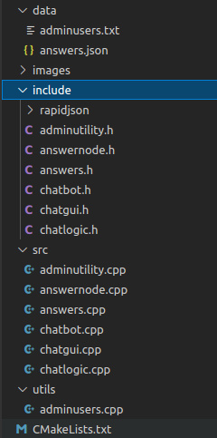
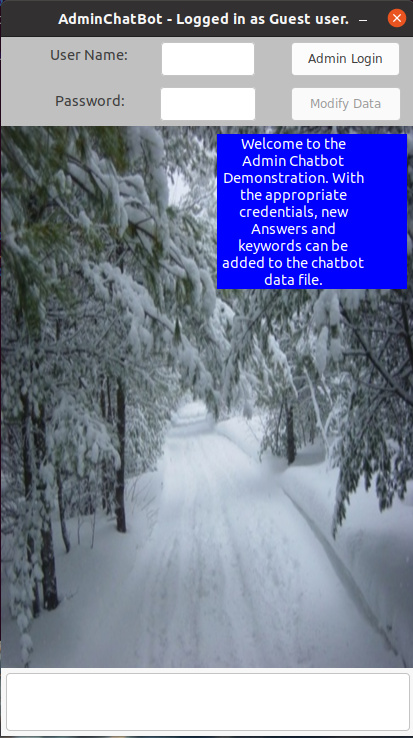

# CPPND: Capstone AdminChatBot!
This readme file is best read on github while in the root directory of the project. https://github.com/astroess/CppND-Capstone-AdminChatbot .  "Capstone Option 1 - Chatbot" was the chosen project option for this capstone.   
The AdminChatBot is made up of 2 applications.  When the project is built using the "Basic Build Instructions" below, 2 executables are generated (adminuser and adminchatbot).  adminuser is a command line program that will allow the admin user to add new Admin users for use within the adminchatbot application.  The adminchatbot executable is the actual chatbot gui application.  Both programs should be run from the /build directory.  

<h2>Dependencies for Running Locally</h2>
* cmake >= 5.5  
* All OSes: [click here for installation instructions](https://cmake.org/install/)  
* make >= 4.1 (Linux, Mac), 3.81 (Windows)  
  <blockquote>* Linux: make is installed by default on most Linux distros 
  * Mac: [install Xcode command line tools to get make](https://developer.apple.com/xcode/features/) - not tested.  
  * Windows: [Click here for installation instructions](http://gnuwin32.sourceforge.net/packages/make.htm) - not tested.</blockquote>
* gcc/g++ >= 5.5  
  <blockquote>* Linux: gcc / g++ is installed by default on most Linux distros 
  * Mac: same deal as make - [install Xcode command line tools](https://developer.apple.com/xcode/features/) - not tested. 
  * Windows: recommend using [MinGW](http://www.mingw.org/) - not tested. </blockquote>
* wxWidgets >= 3.0.  This is already installed in Udacity's workspace.  
* RapidJson >= 1.1.  This is included with the project code.  No extra install is needed.

<h2>Class Files Tree</h2>

<ul>
  <li>The "data" directory contains 2 files for both programs.  The "adminusers.txt" file contains user names and passwords for both programs.  The "answers.json" file contains the keywords and answers for adminchatbot in JSON format.</li>
  <li>The "images" directory contains the images for the AdminChatBot.</li>
  <li>The "include" directory contains the header files and rapidjson parser header files.</li>
  <li>The "src" directory contains the implementation code.</li>
  <li>The "utils" directory contains the adminusers.cpp file that contains the procedural code for adminusers.</li>
  <li>adminutility.h, adminutility.cpp -  These are the header and implementation files for the AdminUtility class. This is a standard utility class with miscellaneous functions used by both programs.</li>
  <li>answernode.h, answernode.cpp - These are the header and implementation files for the AnswerNode class.  This class is delcared and initialized as a unique smart pointer and holds the current state of the keywords/answers' data file in memory.</li>
  <li>answers.h, answers.cpp - These are the header and implementation files for the Answers class.  This class holds the wxWidgets definitions for the Answers Dialog window that contains the JSON data current held in the AnswerNode class.</li>
  <li>chatbot.h, chatbot.cpp - These are the header and implementation files for the ChatBot class.  This class is repsonsible for handling messages between the user and AdminChatbot application.  It also holds the Levenshtein string distance calculation function.</li>
  <li>chatgui.h, chatgui.cpp - These are the header and implementation files for variable wxWidget Frame and Dialog classes for the application.</li>
  <li>chatlogic.h, chatlogic.cpp - These are the header and implementation files for the ChatLogic class.  The ChatLogic class controls the flow of data within the AdminChatBot application.</li>
</ul>

<h2>Basic Build Instructions</h2>

1. Clone this repo, https://github.com/astroess/CppND-Capstone-AdminChatbot.git (for Udacity, this has already been cloned in the submission workspace).
2. Make a build directory in the top level directory: `mkdir build && cd build`
3. Compile: `cmake .. && make`
4. Run it: `./adminuser or ./adminchatbot`.

<b>Suggested Run Path</b>
1. Run adminuser first and add a user/password for yourself.
2. Then run adminchatbot and use the created credentials in the previous step to log in as an admin.  User/passwords are case sensitive.
3. Experiment with adding new answers and keywords, and then using the chatbot to see if the correct answer is returned.  It is assumed that the person running adminchatbot understands the structure of JSON data.
4. It is assumed that both executables will be run from the ./build directory.  Future enhancements could include a properties file that would define data file locations.

<h2>Admin User (adminuser) Details</h2>

Running the "adminusers" program brings the above command line menu up. This is a fairly straight forward procedural program.  It writes/reads credential records to the adminusers.txt file in the /data directory. There is one user (GuestAdmin) currently in the file.  A new record can be added by entering "1" at the command line.  Follow the instructions.  Hitting 2 will bring up the delete sub-menu.  An admin user record list can be viewed by entering "3" at the command line.
  
To exit the program, enter "Q" at the command line of the main menu, otherwise follow the general instructions to back out to the main menu.
  
<b>Admin User Program Features</b>
<ul>
  <li>Passwords are encrypted once a new admin user record is created.</li>
  <li>The same adminuser.txt file is used within the adminchatbot application to authenticate an Admin user.</li>
  <li>Can't Ctrl-C out of the program.  Must quit the from the main menu. </li> 
  <li>There's a lock file mechanism in place so that only one adminusers instance at a time can modify the adminusers.txt file.</li>
</ul>
<h2>AdminChatBot (adminchatbot) Details</h2>

The main chatbot application uses wxWidgets as it's GUI framework.  The main entry point of the application is ChatBotApp::OnInit() in chatgui.cpp.  While at first glance this chatbot might look similar to CppND-Memory-Management-Chatbot, it is however very different.  The intent of this chatbot is for Admin users, who desire to make changes to the keywords/answers, can do so easily using the application.  Changes can also be made to the answers.json using another editor.
  
The general user part of the Admin Chatbot application works like any other chatbot.  The user types in a question or keyword, and an automated question is returned.  To exit the application, click on the red X on the top bar of the window frame.
  
<b>AdminChatBot Features</b>
<ul>
  <li>Admin authentication that includes decryption of the admin password.</li>
  <li>Memory management throughout including the use of smart unique pointers (AnswerNode).</li>
  <li>Multi-Threaded functionality (ChatLogic::RunDataSynchronization).  In a nutshell, when AdminChatBot starts, another thread is spun to synchronize any file changes with the primary AnswerNode.</li> 
  <li>When the application is exiting, the ChatLogic Destructor will make sure that the second thread is stopped.</li>
  <li>Object Oriented Design Classes are used throughout AdminChatBot.</li>
</ul>
 
<h2>Rubric Points</h2>
<ul>
  <li>Loops, Functions, I/O: The code for the adminusers program is in the procedural program utils/adminusers.cpp.  The code is organized into organized functions with I/O functionality at lines 247, 268, and more.  This program reads/writes to/from the adminusers.txt file.  There are also mutliple "Loops" throughout the file.  The program accepts user input in multiple places starting at line 54 in main do/while loop.</li>
  <li>Loops, Functions, I/O: The code for the adminchatbot application is in an object oriented design.  All .cpp files have a corresponding .h header file.  The class functions are organized throughout.  There's file I/O starting at the ChatLogic::LoadAnswersFromJsonFile function (chatlogic.cpp:32).  There's addition I/O functionality in the separate external thread at ChatLogic::RunDataSynchronization (chatlogic.cpp:66).  There are many loops throughout the application in almost every .cpp file.  The application accepts user input starting with Admin authentication at chatgui.cpp:117.  It also accepts user input when an Admin modifies the answer data at answers.cpp:63</li>
  <li>Object Oriented Programming: The adminchatbot application is completely object oriented.  There are appropriate class access modifiers throughout.  See any of the .h header files.  Classes are encapsulated where necessary.  Again, almost any of the .h headers will show this.</li>
  <li>Memory Management: In the adminusers.cpp program line 47 defines a unique smart pointer to hold the admin user data throughout the application.  Most of the other declarations/intializations are kept on the thread stack.  The adminchatbot application uses a similar methodology to keep track of the current answer JSON data at line 34 of the chatlogic.h file.  AnswerNode is passed throughout the application and updated by user changes to the answers.json file. The file chatbot.cpp defines the rule of 5 for the ChatBot class.  Chatbot is moved from chatlogic.cpp:57 to the AnswerNode class (answernode.cpp:10). ChatBots Move Constructor (chatbot.cpp:63) and Move Assignment Operator function (chatbot.cpp:80) get called during this move. </li>
  <li>Concurrency: The adminusers command line program is single threaded.  The adminchatbot is multi-threaded.  There's an external thread that is spun at line 50 of chatlogic.cpp.  The RunDataSynchronization method/function is on 66 of chatlogic.cpp.  In a nutshell, the external thread checks to see if the file date of answers.json changes during execution of the main thread.  The external thread checks every 2 seconds.  If there is a file change internal or external to the application, then the AnswerNode class will get updated.  The second thread is destroyed in the ChatLogic destructor on line 20 of chatlogic.cpp.</li>
</ul> 
 

