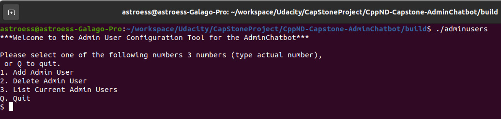

# CPPND: Capstone Admin ChatBot!
The Admin ChatBot is made up of 2 applications.  When the project is built using the "Basic Build Instructions" below, 2 executables are generated (adminuser, adminchatbot).  adminuser is a command line program that will allow the admin user to add new Admin users for use within the adminchatbot application.  The adminchatbot executable is the actual chatbot gui application.  Both programs should be run from the build directory.  

## Dependencies for Running Locally
* cmake >= 5.5
* All OSes: [click here for installation instructions](https://cmake.org/install/)
* make >= 4.1 (Linux, Mac), 3.81 (Windows)
  * Linux: make is installed by default on most Linux distros
  * Mac: [install Xcode command line tools to get make](https://developer.apple.com/xcode/features/)
  * Windows: [Click here for installation instructions](http://gnuwin32.sourceforge.net/packages/make.htm)
* gcc/g++ >= 5.5
  * Linux: gcc / g++ is installed by default on most Linux distros
  * Mac: same deal as make - [install Xcode command line tools](https://developer.apple.com/xcode/features/)
  * Windows: recommend using [MinGW](http://www.mingw.org/)

## Basic Build Instructions

1. Clone this repo, https://github.com/astroess/CppND-Capstone-AdminChatbot.git
2. Make a build directory in the top level directory: `mkdir build && cd build`
3. Compile: `cmake .. && make`
4. Run it: `./HelloWorld`.

## Admin User (adminuser) Details

Running the "adminusers" program brings the above command line menu up. This is fairly straight forward.  The program writes/reads credential records to the adminusers.txt file in the data/ directory. There is one user (GuestAdmin) currently in the file.  A new record can be added by entering "1" at the command line.  Follow the instructions.  Hitting 2 will bring up the delete sub-menu.  An admin user record list can be viewed by entering "3" at the command line.
  
To exit the program, enter "Q" at the command line of the main menu, otherwise follow the general instructions to back out to the main menu.
  
<b>Admin User Program Features</b>
<ul>
 <li>Passwords are encrypted once a new admin user record is created.</li>
 <li>The adminuser.txt file is used primary adminchatbot application to authenticate an Admin user.</li>
</ul>
 
## AdminChatBot (adminchatbot) Details

